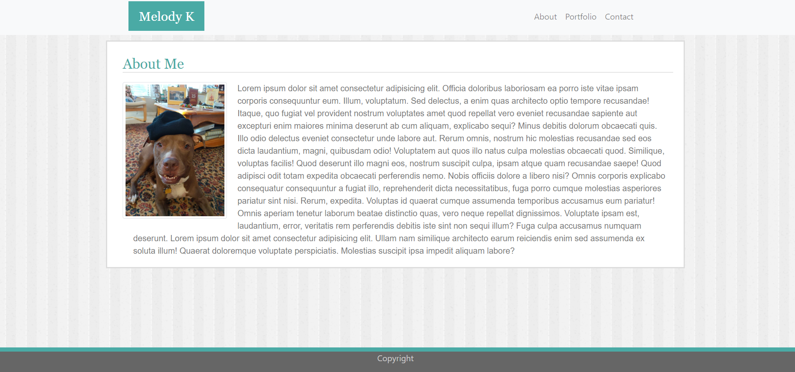
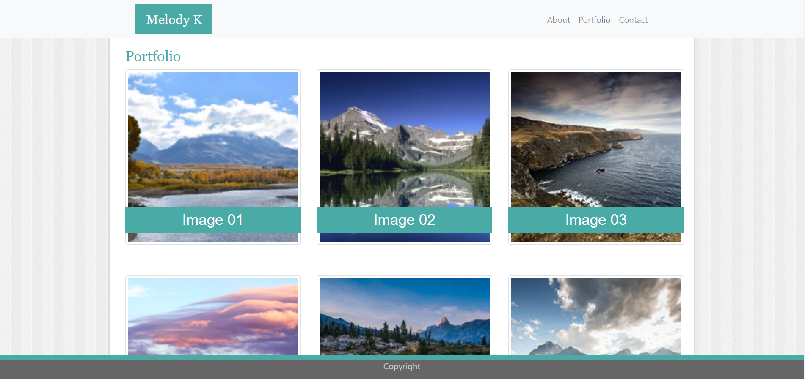
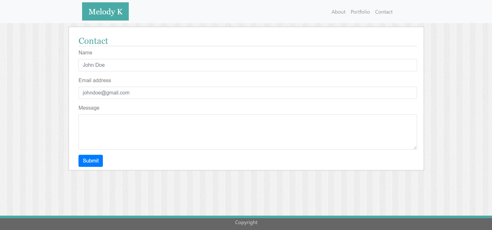

# Responsive Portfolio
## Description
A mobile responsive portfolio to showcase my coding work and let visitors know a little bit about me.

## Table of Contents
* [Installation](#installation)
* [Screenshot](#screenshot)
* [Credits](#credits)

## Installation
In your terminal type:
```git clone https://verlitas.github.io/Responsive-Portfolio/```
* Open in Visual Studio to build and run.
For further instructions, visit https://help.github.com.

## Screenshot




## Credits
[UABootCamp](https://bootcamp.ce.arizona.edu/coding/)
